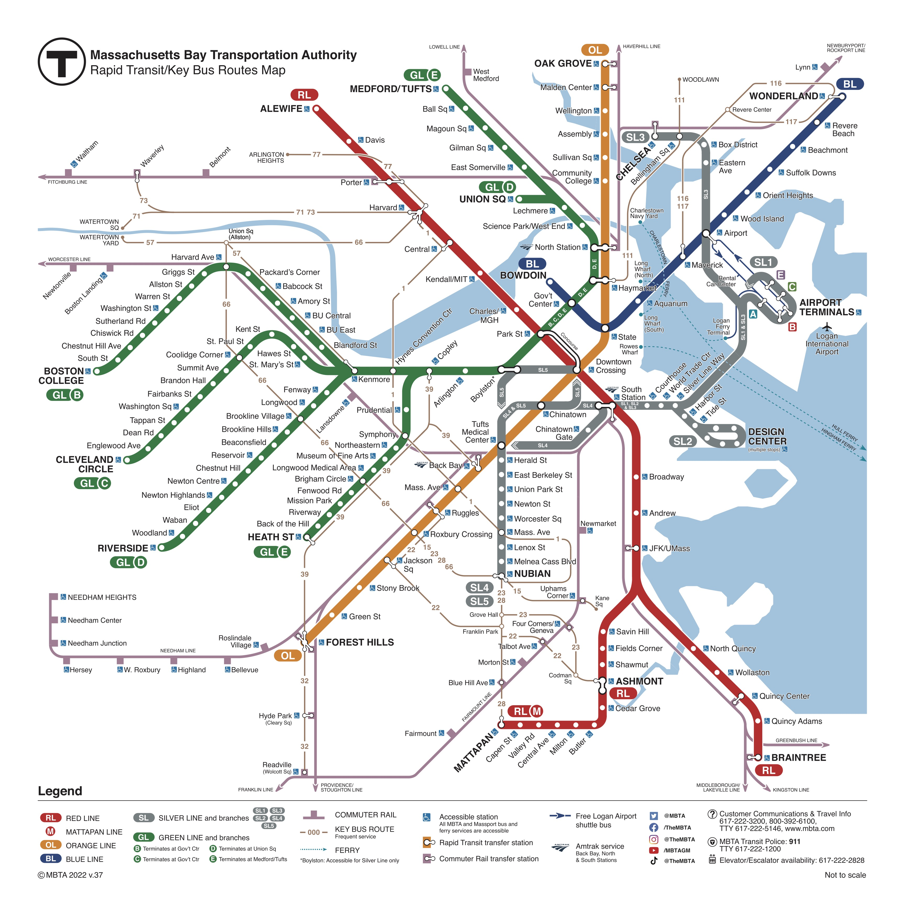

# MBTA-console
>CLI to get info for the MBTA subway system



Python console for querying data from MBTA API


## Installation

    1. Download source files (e.g.)

    ```sh
    git clone git@github.com:agover97/MBTA-console.git
    ```

    2. Setup virtual environment 

    You may need to install venv on Debian/Ubuntu systems:
    ```sh
    python3 --version
    apt install python[VERSION]-venv
    ```


    ```sh
    cd MBTA-console/
    python3 -m venv ./venv
    source venv/bin/activate
    (venv) $
    ```

    3. Install dependencies

    ```sh
    (venv) $ python -m pip install -r requirements.txt
    ```

    Note: This installation setup with tested on a virtual machine running Ubuntu 22.04.3 LTS
    https://ubuntu.com/download/desktop


## Usage example

1) Long names for all light rails and heavy rails

    ```sh
    (venv) $ python3 -m MBTAconsole show-routes
    ```

    example output:

    ```sh
    The MBTA has these subway routes:
    Red Line
    Mattapan Trolley
    Orange Line
    Green Line B
    Green Line C
    Green Line D
    Green Line E
    Blue Line
    ```

2) Name of subway route greatest number of stops and the number of stops on that route

    ```sh
    (venv) $ python3 -m MBTAconsole longest-route
    ```
    example output:

    ```sh
    The Green Line D has the greatest number of stops: 25 stops
    ```
    Note: In the event that two routes are tied for the greatest number of stops, only one with be printed. This should be changed, see TODO section below

3) Name of subway route with fewest stops and the number for stops on that route

    ```sh
    (venv) $ python3 -m MBTAconsole shortest-route
    ```

    example output:

    ```sh
    The Mattapan Trolley has the fewest number of stops: 8 stops
    ```
    Note: In the event that two routes are tied for the fewest number of stops, only one with be printed. This should be changed, see TODO section below

4) List of all the stops that connect two or more subway routes along with the relevant route names for
each of those stops

    ```sh
    (venv) $ python3 -m MBTAconsole connecting-stops
    ```
    example output:

    ```sh
    The following stops connect 2 or more subwy routes:

    Arlington : Green Line B, Green Line C, Green Line D, Green Line E
    Ashmont : Red Line, Mattapan Trolley
    Boylston : Green Line B, Green Line C, Green Line D, Green Line E
    Copley : Green Line B, Green Line C, Green Line D, Green Line E
    Downtown Crossing : Red Line, Orange Line
    Government Center : Green Line B, Green Line C, Green Line D, Green Line E, Blue Line
    Haymarket : Orange Line, Green Line D, Green Line E
    Hynes Convention Center : Green Line B, Green Line C, Green Line D
    Kenmore : Green Line B, Green Line C, Green Line D
    Lechmere : Green Line D, Green Line E
    North Station : Orange Line, Green Line D, Green Line E
    Park Street : Red Line, Green Line B, Green Line C, Green Line D, Green Line E
    Science Park/West End : Green Line D, Green Line E
    State : Orange Line, Blue Line
    ```

5) Rail route between two given stops

    ```sh
    (venv) $ python3 -m MBTAconsole find-route [START] [END]
    ```

    example output:

    ```sh
    (venv) $ python3 -m MBTAconsole find-route "Braintree" "Forrest Hills"

    Braintree to Forest Hills -> Red Line, Orange Line

    ```


## Testing

    1. Follow installation setup above

    2. Run following commands to execute tests

    ```sh
    #move to project dir
    cd MBTA-console/
    #run all test files
    python3 -m pytest tests/*  
    #run specific test file (e.g.) cli_tests.py
    python3 -m pytest tests/cli_tests.py
    ```

    Note: Without api key tests will fail due to requests being throttled. One can avoid this and run specific tests by commenting out other tests in test files and running the above commands. This is not ideal. See TODO

## TOTO

I ran out of time to complete this challange. I was able to implement the required functionaly as specified in the problem description but there are many aspects that could be improved including testing, documentation, code readability, etc. the following is a list of changes that I would implement given more due
